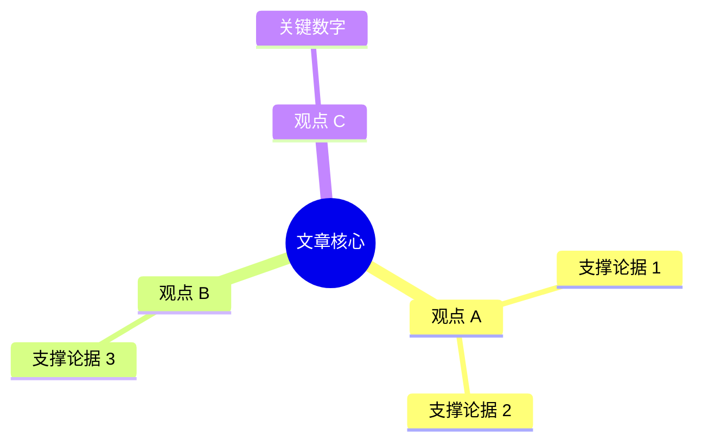
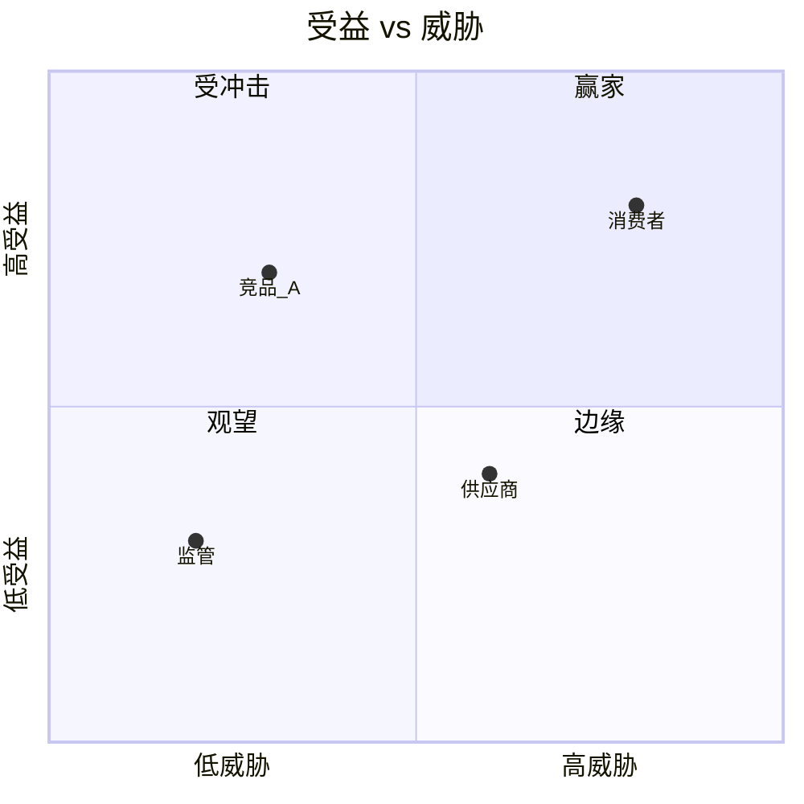
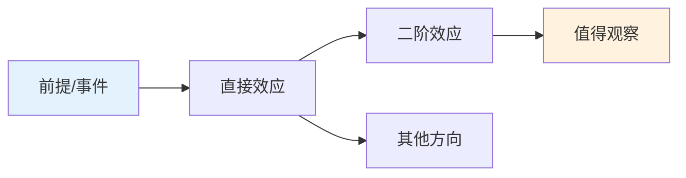
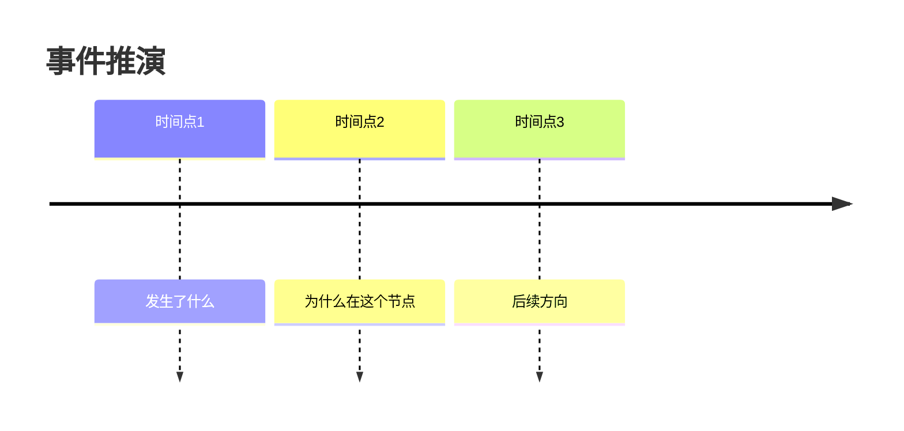
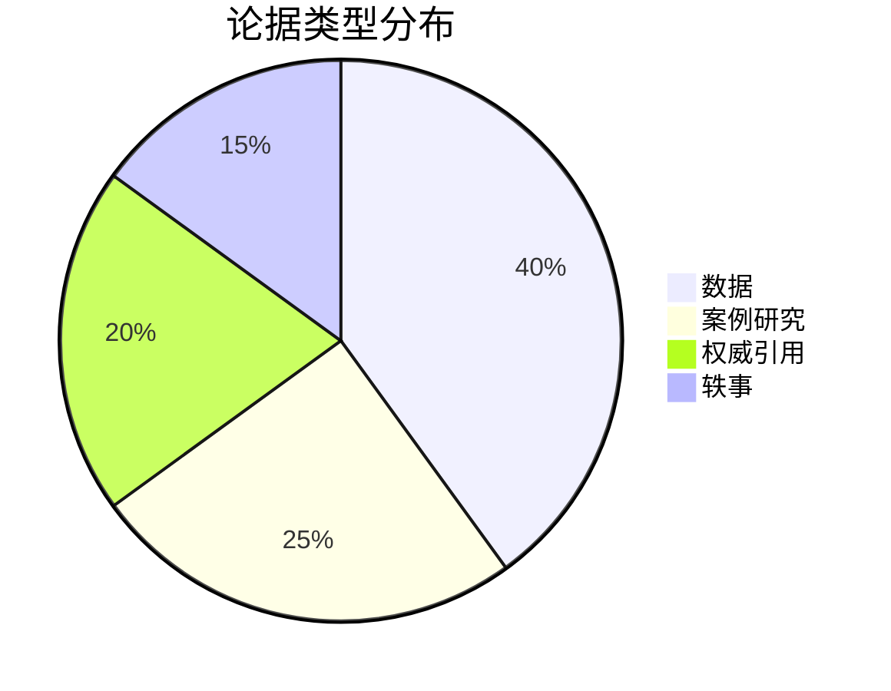
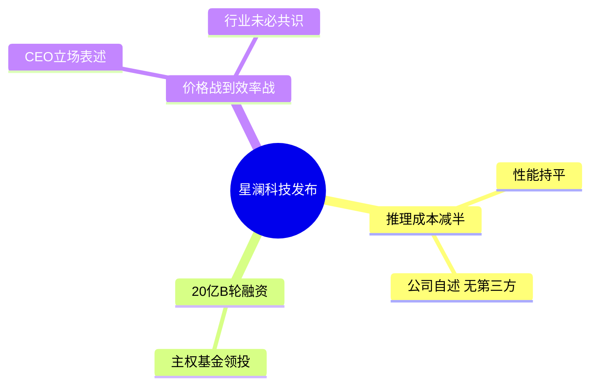

# Keydigger

## Overview

Keydigger turns a piece of news or an article into an interpretation a smart outsider can
understand in minutes: what it says in plain language, what its core viewpoints are, and
what it quietly implies about the future. The value is not summarizing; it is digging.

## Workflow

### 1. Acquire the content

Match the input type:

- **URL / link**: Fetch with the best available web tool (web search, browser, fetch MCP).
  If no web tool exists, run `scripts/fetch_article.py <url>` (Python, stdlib only) to
  extract the main text. If the page is paywalled, blocked, or requires login, say so
  honestly and ask the user to paste the text or provide a screenshot. Never invent
  content for a page you could not read.
- **Pasted text**: Use it directly.
- **Image / screenshot**: Read the text with vision. If parts are illegible, interpret
  what is readable and note the gap.
- **File (PDF, DOCX, etc.)**: Extract the text with the appropriate tool first.
- **Book / long document (EPUB, TXT, MD, long PDF)**: Do NOT try to read it front to
  back into context. Run `scripts/extract_book.py <file> --toc` to get the chapter
  map, then follow the long-form workflow in `references/book-analysis.md`.

Read the FULL text before interpreting. If the source is truncated, say the reading is
based on partial content.

### 2. Understand before judging

Identify: What happened? Who is involved? What is the author trying to convince the
reader of? Note genre (news report, opinion piece, press release, research, rumor) —
genre changes how much trust the claims deserve.

### 3. Dig for viewpoints and implications

**Books and long documents**: use `references/book-analysis.md` instead — it covers
coverage planning (what to read fully vs. sample), framework extraction, argument
mapping, evidence inventory, and the book output template.

**News and articles**: 
Read `references/analysis-framework.md` and apply its lenses: core viewpoints, why-now,
who-benefits, second-order effects, trend signals, what-is-not-said. The hidden
implications are the heart of this skill — never skip them, but always label them as
inference, not fact. For calibration, `references/examples.md` shows a complete model
interpretation.

### 4. Write the interpretation

Use the output format below. Write in the user's language (default: the language of
their request, otherwise the language of the source).

## Output Format

For books, use the book template in `references/book-analysis.md` instead.

Default structure (adapt section names to the output language):

```markdown
## 一句话看懂
1-2 sentences: what happened and why it matters. No jargon.

## 通俗解读
Plain-language retelling: background a layperson needs, then what the article is
actually saying. Explain every technical term in one line; use a concrete analogy
when it helps. Assume a smart reader outside the field.

## 核心观点
Numbered list of the 2-5 viewpoints the article really rests on, each with one line
of support from the text. Distinguish the author's claims from reported facts.

## 深层解读与隐含启示
The dig: why this is happening now, who benefits / who is threatened, second-order
effects, what trend or direction it signals, what to watch next. Mark each insight
with its basis: (基于文中信息推断) or (结合外部背景推测).

## 事实与观点
What is verified fact, what is the author's opinion or framing, what is unverified
or single-sourced. Note the source's likely stance if relevant.

## 对不同读者的意义 (optional)
Concrete implications or directions for the audiences this news touches
(e.g. 从业者 / 投资者 / 普通消费者). Include when the content clearly has them.
```

Scale down gracefully: for a short or simple piece, merge sections rather than padding.
Scale up for long reports: keep the skeleton, deepen each section.

## Visualizing the Output

Use Mermaid diagrams to make structure visible — they render natively in the app,
GitHub, VS Code, and most Markdown viewers. Follow these rules:

- **At most 1-2 diagrams per output.** Choose the section with the richest
  structure. A diagram is a lens, not wallpaper.
- **Always pair a diagram with its textual content.** Some environments
  cannot render Mermaid; the text alone must still be complete.
- **Label in the output language.** Prefer the user's language in node text.
- **Use double-quoted Mermaid node labels** when text contains parentheses,
  brackets, or punctuation that conflicts with Mermaid syntax.

Recipe templates by section (adapt to the actual content):

| 最佳图表位置 | 推荐图表类型 | 什么时候用 |
|------|------|------|
| 核心观点 | mindmap | 3-5 个观点之间有层级或并行关系时 |
| 深层解读/隐含启示 | quadrantChart 或 flowchart LR | 需要展示各方博弈或多阶段传递效应时 |
| 对不同读者的意义 | flowchart LR | 不同人群分支清晰时 |
| 全书框架 | mindmap 或 flowchart TB | 思维模型有层级或概念间关联时 |
| 核心论点与逻辑链 | flowchart TB | 论证有多步或隐含前提时 |
| 时间线/为什么是现在 | timeline | 事件跨越多个时间节点时 |
| 论据分布 | pie | 不同论据类型权重差异明显时 |
| 各方受益/威胁 | quadrantChart | 需要快速比较多个利益相关者时 |

### mindmap - 核心观点 / 全书框架



### quadrantChart - 深层解读 / 利益相关者地图



### flowchart - 逻辑链 / 二阶效应 / 因果传递



### timeline - 事件脉络



### pie - 论据类型



### 示例：一篇科技新闻的核心观点可视化

```markdown
## 核心观点



1. 新模型推理成本降低 50%、性能持平（公司宣称，无第三方评测佐证）。
2. 完成 20 亿元 B 轮融资，主权基金领投。
3. CEO 判断行业竞争焦点从价格转向效率（观点，服务于公司叙事）。
```


### Visual Hierarchy — Highlighting What Matters

The reader should grasp the most important takeaway from each section in 3 seconds.
Use these techniques to make the signal visually distinct from the noise:

| 技术 | 用法 | 效果 |
|---|---|---|
| Executive Summary Bar | 4 KPI 卡片放在最上方，每个卡片一个核心关键词+一行子标题 | 3 秒扫描全文梗概 |
| TL;DR Callout Box | "一句话看懂"用悬浮色块 + 加大字重 + 关键短语用对比色 | 最核心判断一眼可见 |
| 重点高亮 (.highlight) | 每节最重要的 1 个句子用淡黄底 + 左侧色条 + 关键词橙色 | 断句读也能抓住信号 |
| 观点编号圈 | 核心观点用圆角编号（圈内数字），关键主语加粗 | 列表不再扁平 |
| 推断标签 (.tag-inf) | 每条隐含启示前带彩色标签（🔵基于文中 / 🟠结合外部 / 🟢可核实事实 / 🔴待跟踪） | 读者立刻知道这句话的"可信级别" |
| 术语对照表 | 政策术语用两列网格解释（原文→通俗说法），不打断正文 | 需要快查的人直接找 |
| 受众四色卡片 | 不同读者群体用 4 色卡片（绿/红/紫/橙），每种颜色暗示一种立场 | 身份导向，快速定位自己的那一块 |
| 原始文本折叠 | 原文用 `<details>` 折叠，保持输出干净但可溯源 | 验证和阅读两不误 |

**规则：**
- 每个输出至少使用 2 种层次技术（默认：TL;DR box + 推断标签系统）。
- 不要对每一句话都加高亮——高亮的效果与使用频率成反比。
- 颜色不能是唯一的区分方式：色盲读者和纯文本环境需要文字标签兜底。
- 标签文字（如"基于文中信息推断""待跟踪"）必须与输出语言一致。
- 在 HTML 输出中优先使用 class 化 CSS（tldr, highlight, insight-list, stakeholder-grid 等），
  在 Markdown 输出中使用 emoji + 加粗 + 引用块来模拟层次。


- **Plain language is mandatory.** If a sentence needs domain knowledge to parse,
  rewrite it. Test: would a curious high-schooler follow it?
- **Separate fact from inference.** Article facts, author opinions, and your own
  extrapolations must be visibly different. Implication sections are inference —
  label their basis.
- **Stay grounded in the source.** Do not add claims the source does not support.
  When outside context genuinely helps (background, a trend), flag it as external.
- **No fake certainty.** Use confidence language: 可能 / 大概率 / 值得观察. A wrong
  prediction stated confidently is worse than no prediction.
- **Respect paywalls and gaps.** Partial content = partial interpretation, stated
  upfront.
- **Keep the user's stake in mind.** If the user says who they are (investor,
  student, founder), weight the implications toward their angle.

## References

- `references/analysis-framework.md` — the digging lenses and per-domain angles
  (tech, finance, policy, company, science). Read before step 3 on any non-trivial
  piece.
- `references/book-analysis.md` — long-form workflow for books and lengthy reports:
  coverage planning, framework and argument extraction, book output template.
- `references/examples.md` — a complete worked example showing target depth and tone.

## Scripts

- `scripts/fetch_article.py` — fetch a URL and extract the main article text
  (stdlib-only Python). Usage: `python scripts/fetch_article.py <url> [--output file]`.
  Also accepts a local HTML file path.
- `scripts/extract_book.py` — extract chapter map and text from EPUB/TXT/MD books
  (stdlib-only Python). Usage: `python scripts/extract_book.py <file> [--toc]`
  `[--chapter N] [--output file]`. For PDFs use the environment's own PDF tools.
