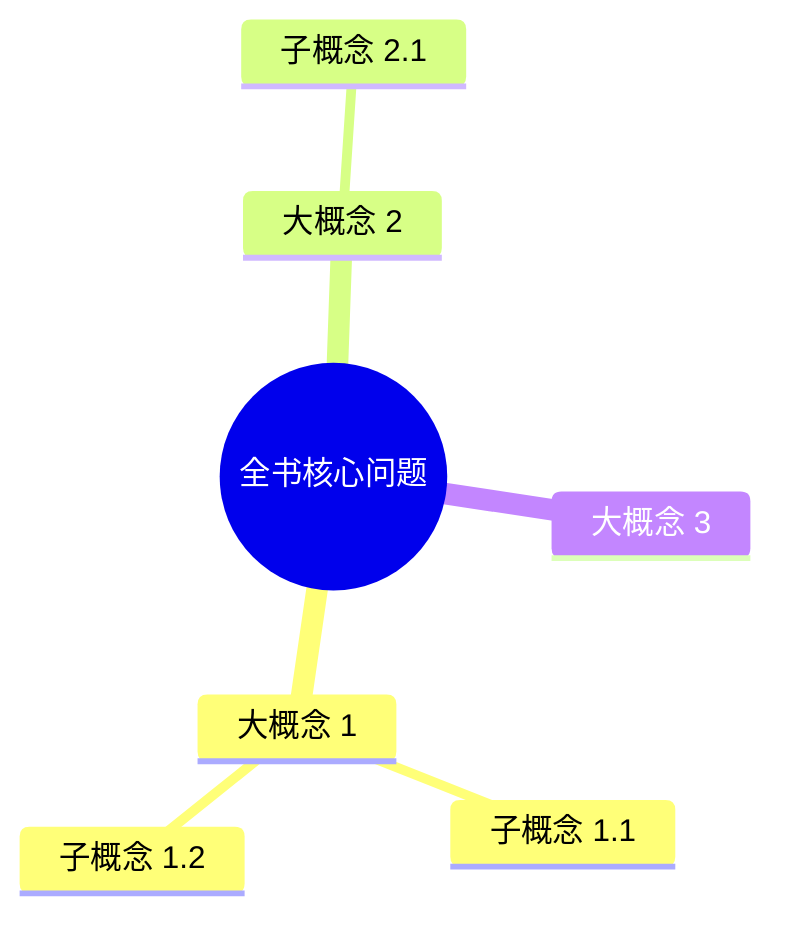
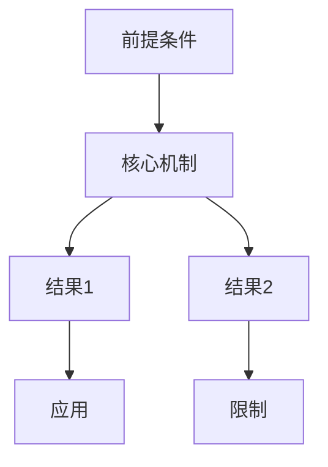
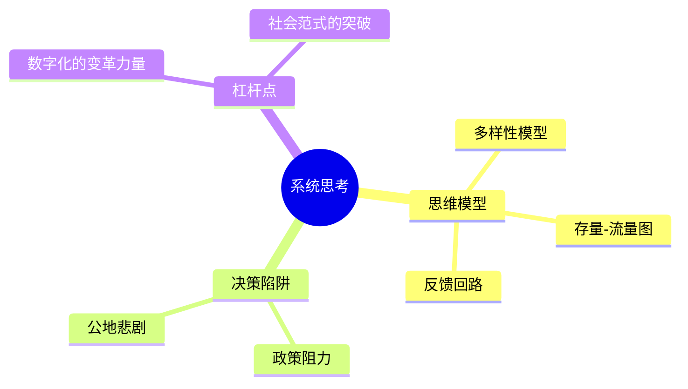
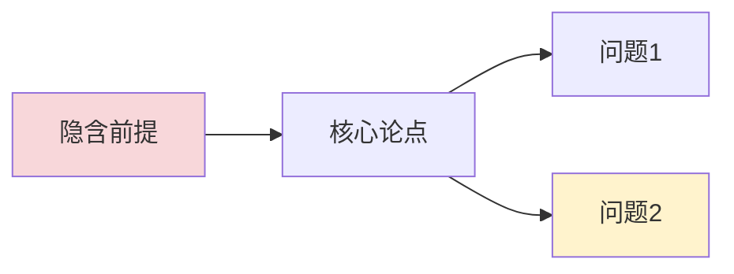

# Book & Long-Form Analysis

Workflow for books, long reports, and other documents too long to read front to back.
The goal is the same as short-form — dig, don't summarize — but the unit of analysis
changes: a book's value is its framework, logic chain, and evidence system.

Contents:
1. Honesty about coverage
2. Step A: map the book
3. Step B: plan the reading
4. Step C: dig (five lenses for books)
5. Book output template

## 1. Honesty About Coverage

Never imply you read more than you did. State coverage in one line at the top of the
output: 全书精读 / 骨架+重点章节精读 / 仅目录与首尾章. A skeleton-based reading is
legitimate for a first pass — pretending it is a full reading is not.

## 2. Step A: Map the Book

Get the chapter map before reading anything in depth:

```bash
python scripts/extract_book.py book.epub --toc          # chapter list + char counts
python scripts/extract_book.py book.epub -o book.txt    # full text with chapter markers
python scripts/extract_book.py book.epub --chapter 3    # one chapter only
```

Supports EPUB/TXT/MD. For PDF, extract text with the environment's PDF tools first,
then treat it as TXT. If the user only names a book without providing a file, ask for
the file or proceed from your own knowledge of the book — and say which you did.

## 3. Step B: Plan the Reading

Match effort to book size and user intent:

- **Short (< ~40k chars)**: read fully.
- **Long, user wants a quick map**: read table of contents + preface/intro +
  conclusion + each chapter's opening and closing sections. Then deep-read the 1-3
  chapters that carry the core argument.
- **Long, user wants depth**: read fully, chapter by chapter, keeping running notes
  per chapter (claim, reasoning, evidence, one-line takeaway).

Prefaces and conclusions punch above their weight: authors state their thesis and
their intended contribution there. Read them even in the fastest pass.

## 4. Step C: Dig — Five Lenses for Books

### Lens 1: The core question
What question is the book trying to answer? One sentence. If you cannot state it,
you have not found the book's center. Beware books whose real question differs from
their marketed one.

### Lens 2: The framework
The author's mental model: key concepts, distinctions, and how they connect
(e.g. "System 1 vs System 2"). Render it as a compact map — a short indented list or
a mermaid diagram if the structure is genuinely relational. This is usually the
book's most transferable asset.

### Lens 3: The logic chain
How the argument flows: premises -> reasoning -> conclusions. Note load-bearing
steps — the claims the whole book collapses without. Check for jumps: steps where
the author asserts rather than demonstrates.

### Lens 4: The evidence inventory
What kinds of support does the author actually use — data, experiments, case studies,
anecdotes, authority quotes, thought experiments? Assess quality: representative or
cherry-picked? Replicable or one-off? Current or dated? A book heavy on anecdotes
should be labeled as such.

### Lens 5: Assumptions, blind spots, and implications
What must be true for the argument to hold? What does the author ignore ( opposing
evidence, contexts where the framework breaks, who benefits from this narrative)?
Then the keydigger move: what does this framework imply for the reader's decisions,
and what is it worth watching in the real world?

## 5. Book Output Template

For each section below, consider whether a Mermaid diagram would make the
structure immediately visible. The "全书框架" section almost always should be
a diagram — it is the author's mental model, and a text-only list loses the
relational shape. Use the recipes in SKILL.md ("Visualizing the Output") for
syntax references.

```markdown
## 一句话看懂
The book's core question and its answer in 1-2 plain sentences.

## 阅读覆盖说明
One line: what was read (全书精读 / 骨架+第X、Y章精读), and source (用户提供的文件 /
基于模型已有知识).

## 全书框架 (推荐用 Mermaid)
Visualize the author's mental model. Two options:

**Option A: mindmap** — when the framework is hierarchical (core concept →
branches → sub-concepts). Best for most non-fiction books.



**Option B: flowchart TB** — when the framework is a process or decision tree
(Step A → B → C).



Follow the diagram with one plain paragraph per concept, explaining what each
box means in one line. This keeps the output accessible even when mermaid does
not render.

**例：全书框架（mindmap + 文字说明）**

```markdown


- **思维模型**：理解复杂系统需要三种基本工具
- **决策陷阱**：常见模式错误及其识别方法
- **杠杆点**：12 个干预点的排序，数字和范式层面的杠杆最高
```

## 核心论点与逻辑链
3-7 core arguments, each: 论点 -> 作者如何论证 -> 依赖的前提. Mark the load-bearing
steps and any logical jumps.

## 关键论据
The evidence that matters most, typed (数据 / 实验 / 案例 / 轶事 / 权威背书), with a
quality note each (代表性 / 可复现性 / 时效性).

## 隐含启示与批判性思考
Assumptions the book silently makes; blind spots and counterexamples; what the
framework implies for practice; where it likely stops working. Label inference.

If the chain of reasoning is multi-step, consider a flowchart:



## 通俗解读 (optional, for dense books)
The hardest 1-2 ideas re-explained with everyday analogies.

## 对不同读者的意义 (optional)
Who benefits most from this book; what to do differently after reading; what to
read next if the topic matters.
```

Scale to the request: "快速挖框架" = 一句话看懂 + 全书框架 + 核心论点, skip the rest.
Full 拆书 = whole template.

### Visualizing the Book Output — Quick Reference

| 输出章节 | 推荐图表 | 场景 |
|---|---|---|
| 全书框架 | mindmap / flowchart TB | 大多数非虚构书籍首选 |
| 核心论点与逻辑链 | flowchart TB | 论证有多步或隐含前提时 |
| 关键论据 | pie | 论据类型权重有明显差异时 |
| 隐含启示 | quadrantChart | 需要比较利弊或各方立场时 |

Always pair with explanatory text. Never rely solely on a diagram.

### Example: Full Framework Visualization

For a complete visual book template, see `SKILL.md` → "Visualizing the Output"
for diagram syntax, and `references/examples.md` → "可视化版本" for a
non-fiction book style reference.
